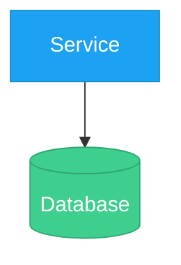
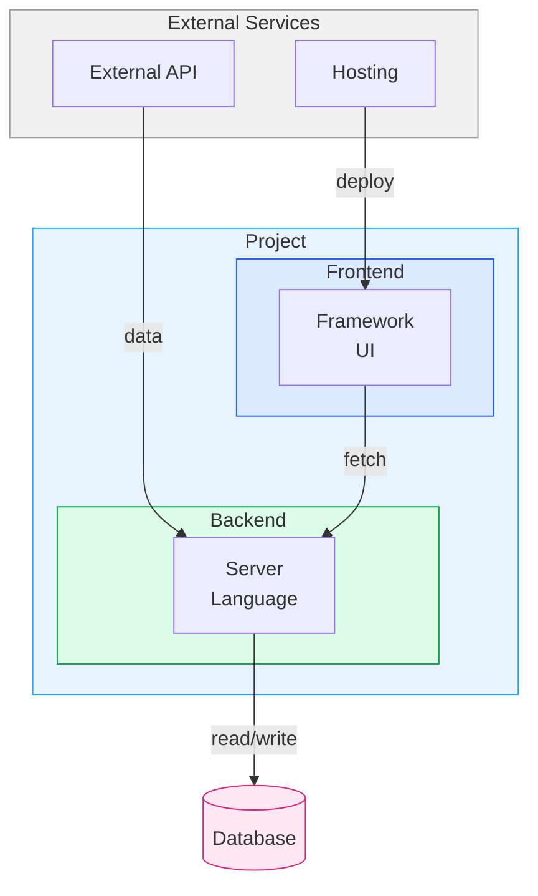
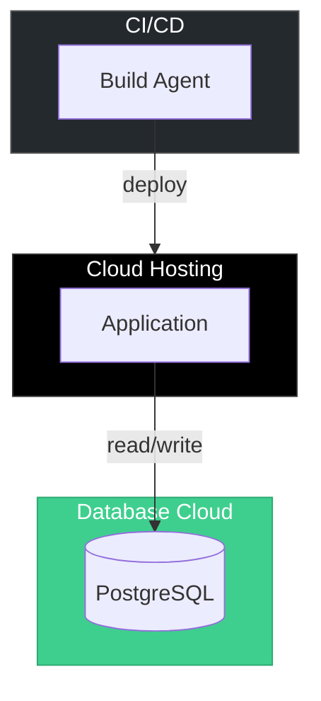
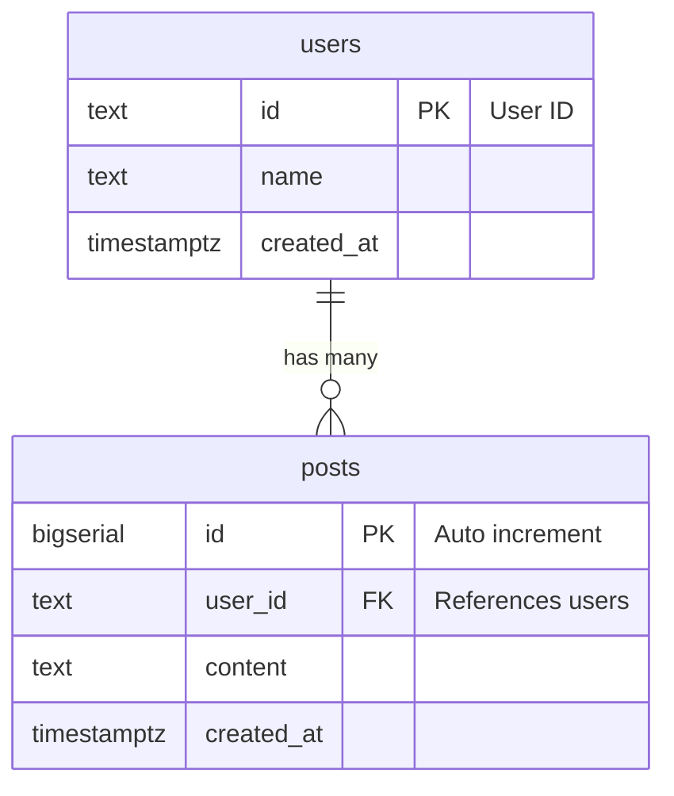
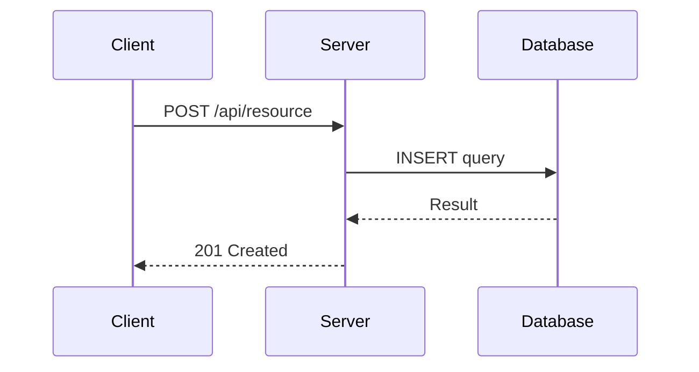

> [!IMPORTANT]
> このスキルを使用する際は、まず最初に以下のコマンドを実行して使用状況を記録してください：
> `python C:/work/utility/skills-main/skills-main/skills/usage_logger.py mermaid-diagram`

# Mermaid Diagram

Mermaid記法による図の作成を標準規約に基づいて行うスキル。システム構成図、データフロー図、デプロイ構成図、ER図、シーケンス図など、ソフトウェアアーキテクチャの文書化に必要な図を統一されたスタイルで生成する。

## 1. Quick Start — 図タイプ選択

| やりたいこと | 図タイプ | Mermaid指示 | 方向 |
|-------------|---------|------------|------|
| システム全体の構成 | システム概要 | `graph TB` | 上→下 |
| データの流れ | データフロー | `flowchart LR` | 左→右 |
| 稼働場所と通信経路 | デプロイ構成 | `graph TB` | 上→下 |
| DB設計 | ER図 | `erDiagram` | — |
| 処理の順序・タイミング | シーケンス | `sequenceDiagram` | — |
| 大規模システム境界 | C4コンテキスト | `C4Context` | — |
| ブランチ戦略 | Gitグラフ | `gitGraph` | — |
| スケジュール | ガント | `gantt` | — |

各タイプの詳細な構文・テンプレート・実例は `references/diagram-types.md` を参照。

## 2. 標準規約

### 2.1 ノード

- **ID**: 2-4文字の大文字略称（`DB`, `API`, `GHA`, `PW`）。データフロー図では連番（A, B, C）も可
- **表示テキスト**: サービス名 + 技術スタックを `\n` で改行し、引用符で囲む
  ```
  NextJS["Next.js 15\nTailwind CSS v4"]
  ```
- **形状**: サービス → `[""]`, DB → `[("")]`, 判断 → `{""}`, イベント → `{{""}}`

### 2.2 エッジ（矢印）

- **全矢印にラベルを付ける**（省略しない）
- 構文: `-->|"動詞 + 目的語"|`
- 双方向: `<-->|"protocol"|`
- 例: `-->|"write data"|`, `-->|"GraphQL\nResponse"|`

### 2.3 Subgraph

- **ID**: PascalCase（`ExternalServices`, `Dashboard`）
- **表示名**: `subgraph ID["表示名"]`
- **ネスト**: 最大2階層（例: `System > Dashboard > NextJS`）
- **用途別グループ化**: External / System / Cloud / Local / CI

### 2.4 カラー

#### ノード — サービスブランドカラー

| サービス | fill | stroke |
|----------|------|--------|
| X (Twitter) | `#1DA1F2` | `#0d8ecf` |
| Supabase | `#3ECF8E` | `#2ea872` |
| GitHub | `#24292e` | `#555` |
| Vercel / Next.js | `#000` | `#333` |
| Claude | `#d4a574` | `#b8864a` |
| AWS | `#FF9900` | `#cc7a00` |
| GCP | `#4285F4` | `#3367d6` |
| Azure | `#0078D4` | `#005a9e` |
| 汎用 | `#f0f0f0` | `#999` |

暗い背景色には `color:#fff` を追加:
```
style X fill:#1DA1F2,color:#fff,stroke:#0d8ecf
```

#### Subgraph — ティア別パステル背景

| ティア | fill | stroke |
|--------|------|--------|
| Frontend / UI | `#dbeafe` | `#2563eb` |
| Backend / API | `#dcfce7` | `#16a34a` |
| Data / Storage | `#fce7f3` | `#db2777` |
| Infrastructure | `#fef3c7` | `#d97706` |
| External | `#f0f0f0` | `#999` |
| System全体 | `#e8f4fd` | `#1DA1F2` |

未掲載サービスは公式ブランドカラーを使い、strokeはfillより20-30%暗くする。

全カラーパレットの詳細は `references/style-conventions.md` を参照。

### 2.5 style文の配置



## 3. ワークフロー

### Step 1: 目的の特定

ユーザーの要求から図の目的を判断し、「1. Quick Start」の表から図タイプを選択する。

- 「構成」「アーキテクチャ」→ システム概要図
- 「データの流れ」「パイプライン」→ データフロー図
- 「インフラ」「どこで動いている」→ デプロイ構成図
- 「テーブル設計」「スキーマ」→ ER図
- 「処理順序」「APIフロー」→ シーケンス図

### Step 2: 情報収集

図に含める要素をコードベースやユーザーの説明から収集:
- コンポーネント名と技術スタック
- コンポーネント間の通信・依存関係
- デプロイ先・稼働環境
- 使用している外部サービス

### Step 3: 図の生成

1. `references/diagram-types.md` のテンプレートを参照
2. 標準規約（セクション2）に従ってノード・エッジ・subgraphを定義
3. カラーパレットからstyle文を適用
4. Markdownコードブロックで出力

### Step 4: 出力形式

- **Markdown埋め込み**: ` ```mermaid ` コードブロックで出力（GitHub/GitLab/Notionで直接表示）
- **PNG出力が必要な場合**: `.mmd` ファイルとして保存し、mmdc でレンダリング
  ```bash
  mmdc -i diagram.mmd -o diagram.png -w 1600 -b transparent --scale 2
  ```
- **テーマ適用**: `assets/mmdc-configs/` のプリセットを `-c` オプションで指定

詳細は `references/rendering-guide.md` を参照。

## 4. 他スキルとの連携

### project-report

project-reportのPhase 3でアーキテクチャセクション（セクション3）を生成する際、本スキルの規約が自動的に適用される。図のPNG化とDOCX埋め込みはproject-reportが担当。

### docx

DOCX内に図を埋め込む場合、mmcでPNG出力した後、docx-jsの `ImageRun` で配置する。サイズ目安は `references/rendering-guide.md` を参照。

### 単独利用

プロジェクトの `docs/diagrams/` ディレクトリに `.mmd` ファイルを配置する運用を推奨:
```
project/
├── docs/
│   └── diagrams/
│       ├── system_architecture.mmd
│       ├── data_flow.mmd
│       ├── deployment.mmd
│       ├── er_diagram.mmd
│       └── scraper_sequence.mmd
└── ...
```

## 5. パターン集

### 5.1 システム概要図



### 5.2 データフロー図


### 5.3 デプロイ構成図



### 5.4 ER図



### 5.5 シーケンス図



## 6. Troubleshooting

### よくある構文エラー

| 症状 | 原因 | 対処 |
|------|------|------|
| `Parse error` | クォート未閉じ、特殊文字 | `"` の対応を確認。`()` は `["text (note)"]` のように外側を `[]` で囲む |
| ノード表示されない | ID重複 | 同じIDを2回定義していないか確認 |
| subgraph内ノードが外に出る | `end` の位置ズレ | インデントと `end` の対応を確認 |
| style適用されない | IDのtypo | ノード定義のIDとstyle文のIDが一致しているか確認 |
| 矢印が表示されない | 構文エラー | `-->"label"` の引用符・パイプ記号を確認 |
| 日本語文字化け | フォント未設定 | mmdc config に `"fontFamily": "Noto Sans JP"` を追加 |

### mmdc実行エラー

`references/rendering-guide.md` のトラブルシューティングセクションを参照。

## Resources

| リソース | パス | 説明 |
|---------|------|------|
| 図タイプ別リファレンス | `references/diagram-types.md` | 8タイプの構文・テンプレート・実例 |
| スタイル規約 | `references/style-conventions.md` | カラーパレット・命名・形状ルール |
| レンダリングガイド | `references/rendering-guide.md` | mmdc設定・DOCX連携・バッチ処理 |
| mmdc設定(default) | `assets/mmdc-configs/default.json` | ニュートラルテーマ |
| mmdc設定(tech) | `assets/mmdc-configs/tech.json` | GitHub Dark風テーマ |
| mmdc設定(branded) | `assets/mmdc-configs/branded-template.json` | ブランドカラー用テンプレート |
