# Diagram Types — 図タイプ別リファレンス

## 1. システム概要図 (System Overview)

コンポーネント間の関係と全体構成を示す。

- **指示**: `graph TB`
- **用途**: プロジェクト全体のアーキテクチャ俯瞰
- **特徴**: subgraphで階層的にグループ化、ネスト2階層まで

### テンプレート

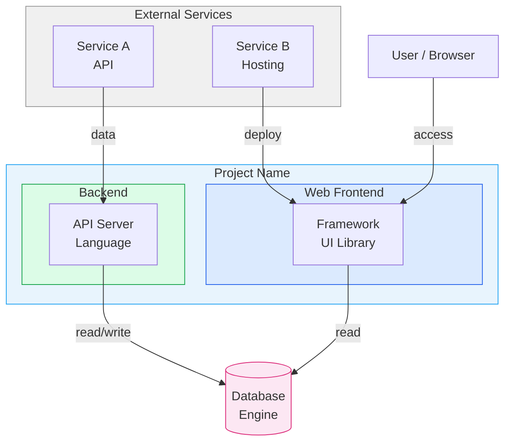

### 実例（reverve-X-analysis）

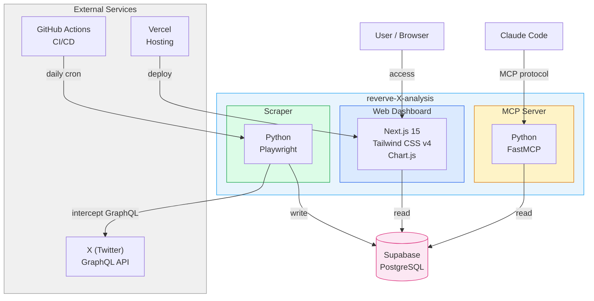

---

## 2. データフロー図 (Data Flow)

入力→処理→出力のパイプラインを示す。

- **指示**: `flowchart LR`
- **用途**: データの変換・流れの可視化
- **特徴**: 左から右への流れ、ノードにブランドカラー適用

### テンプレート

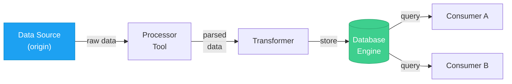

### 実例（reverve-X-analysis）

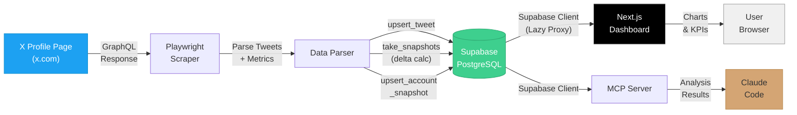

---

## 3. デプロイ構成図 (Deployment)

インフラ階層とホスティングトポロジを示す。

- **指示**: `graph TB`
- **用途**: 各コンポーネントの稼働場所と通信経路
- **特徴**: subgraphでデプロイ先（Cloud/CI/Local等）をグループ化、ブランドカラーをsubgraphに適用

### テンプレート

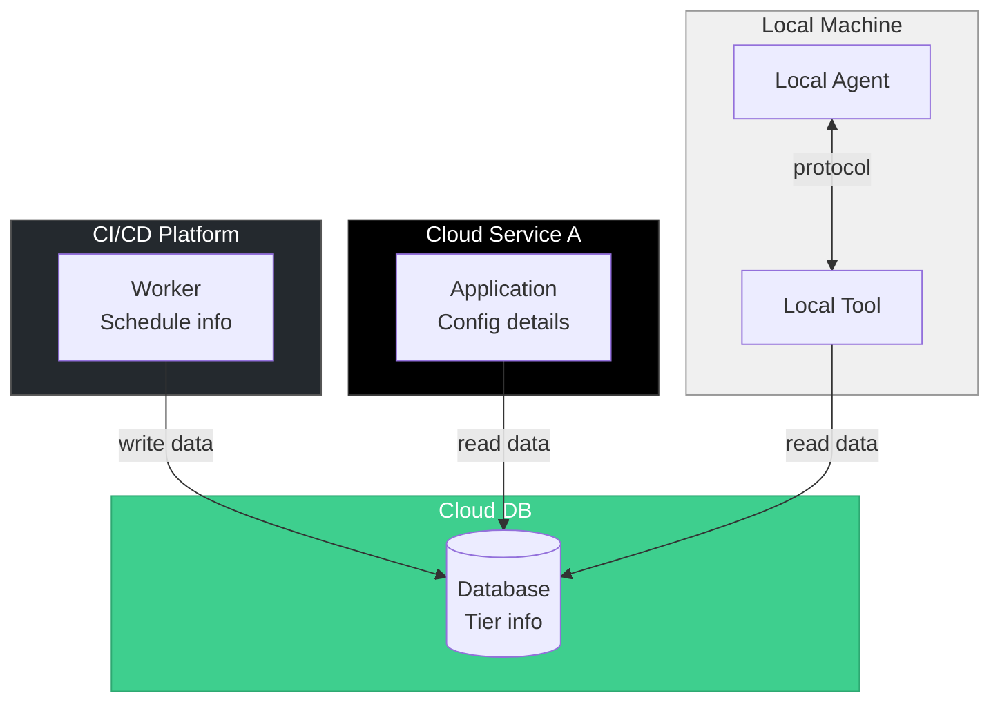

### 実例（reverve-X-analysis）

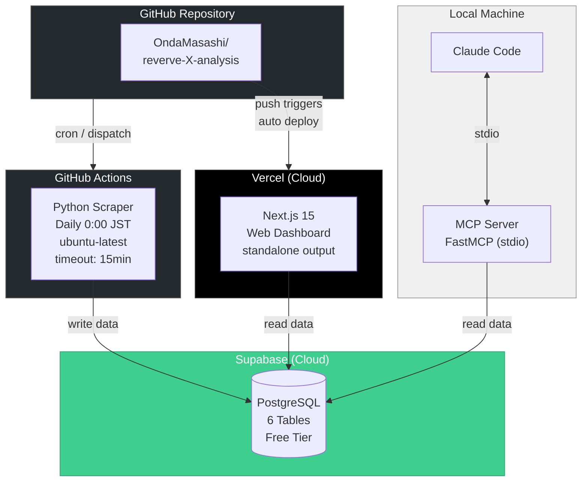

---

## 4. ER図 (Entity-Relationship)

データベーススキーマとエンティティ間の関係を示す。

- **指示**: `erDiagram`
- **用途**: テーブル設計、リレーション定義
- **特徴**: Mermaidネイティブ構文、カーディナリティ表記

### 構文リファレンス

```
テーブル名 {
    データ型 フィールド名 属性 "説明"
}
```

属性: `PK`（主キー）、`FK`（外部キー）、`UK`（ユニークキー）

カーディナリティ:
| 記号 | 意味 |
|------|------|
| `\|\|--o{` | 1対多 |
| `\|\|--\|\|` | 1対1 |
| `o{--o{` | 多対多 |
| `\|\|--o\|` | 1対0または1 |

### テンプレート

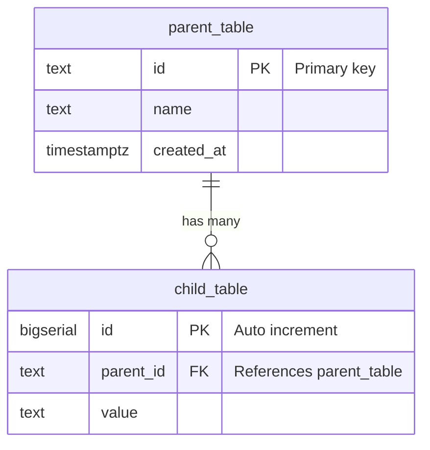

### 実例（reverve-X-analysis）

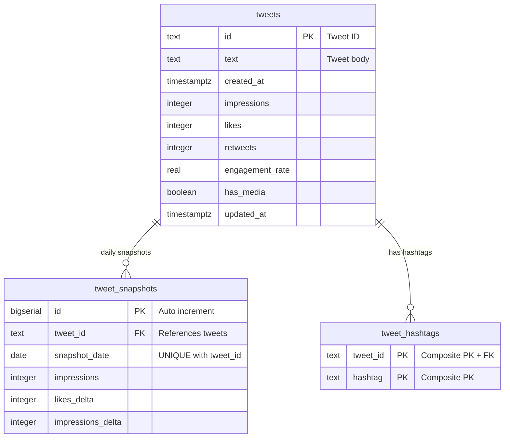

---

## 5. シーケンス図 (Sequence)

コンポーネント間の時系列インタラクションを示す。

- **指示**: `sequenceDiagram`
- **用途**: API呼び出しフロー、ユーザーインタラクション、処理タイミング
- **特徴**: participant定義、ループ・ノート注釈

### 構文リファレンス

| 要素 | 構文 |
|------|------|
| 参加者定義 | `participant ID as "表示名"` |
| 同期リクエスト | `->>` |
| レスポンス | `-->>` |
| 注釈 | `Note over A,B: テキスト` |
| ループ | `loop 説明` ... `end` |
| 条件分岐 | `alt 条件` ... `else` ... `end` |
| オプション | `opt 条件` ... `end` |

### テンプレート

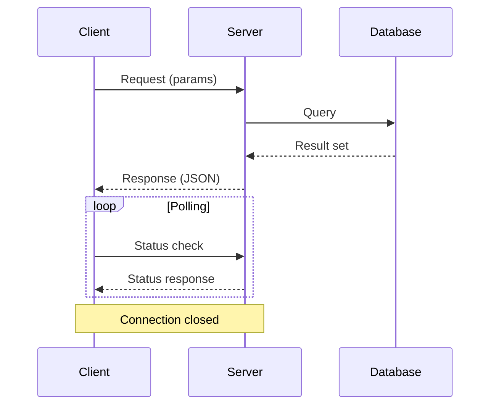

### 実例（reverve-X-analysis）

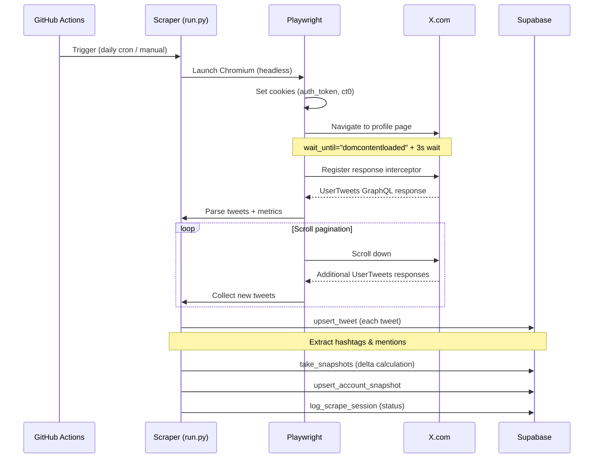

---

## 6. C4コンテキスト図 (C4 Context)

エンタープライズレベルのシステム境界を示す。複数システム間の関係を俯瞰する場合に使用。

- **指示**: `C4Context`
- **用途**: 大規模システムの外部境界、利用者とシステムの関係
- **特徴**: `Person`, `System`, `System_Ext`, `Boundary` キーワード
- **注意**: 小規模プロジェクトでは「1. システム概要図」で十分。C4は複数チーム・複数システムが絡む場合に有効

### テンプレート

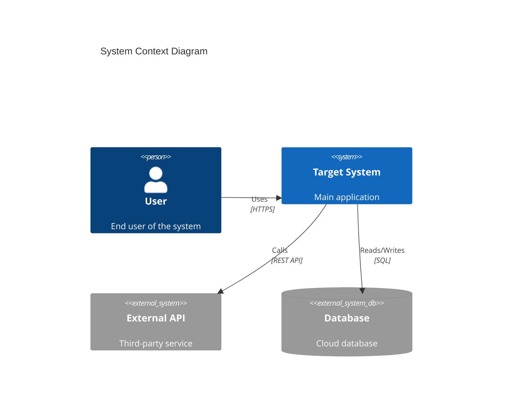

---

## 7. Gitグラフ (Git Graph)

ブランチ戦略とマージフローの可視化。

- **指示**: `gitGraph`
- **用途**: ブランチ戦略の説明、開発フロー文書

### テンプレート

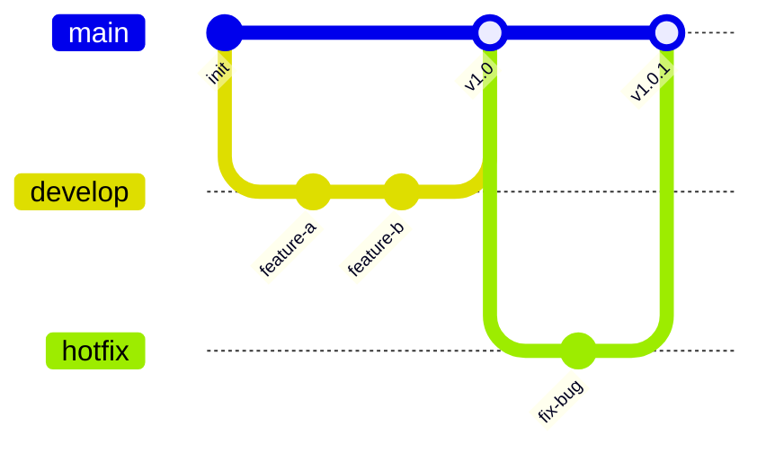

---

## 8. ガントチャート (Gantt)

タイムラインとマイルストーンの可視化。

- **指示**: `gantt`
- **用途**: プロジェクトスケジュール、フェーズ管理

### テンプレート

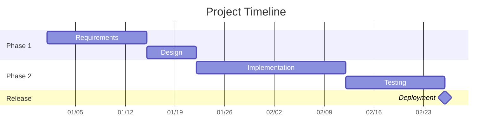

---

## 図タイプ選択ガイド

| やりたいこと | 推奨タイプ |
|-------------|-----------|
| システム全体の構成を見せたい | 1. システム概要図 |
| データの流れを追いたい | 2. データフロー図 |
| どこで何が動いているか示したい | 3. デプロイ構成図 |
| DB設計を文書化したい | 4. ER図 |
| 処理の順序・タイミングを示したい | 5. シーケンス図 |
| 複数システムの境界を俯瞰したい | 6. C4コンテキスト図 |
| ブランチ戦略を説明したい | 7. Gitグラフ |
| スケジュールを示したい | 8. ガントチャート |
