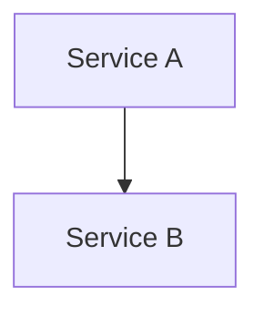

# Rendering Guide — Mermaid図のレンダリング

## 1. mmdc (Mermaid CLI) セットアップ

```bash
npm install -g @mermaid-js/mermaid-cli
```

バージョン確認:
```bash
mmdc --version
```

## 2. 基本コマンド

### PNG出力（推奨）

```bash
mmdc -i diagram.mmd -o diagram.png -w 1600 -b transparent --scale 2
```

| オプション | 値 | 説明 |
|-----------|-----|------|
| `-i` | `diagram.mmd` | 入力ファイル |
| `-o` | `diagram.png` | 出力ファイル（拡張子で形式決定） |
| `-w` | `1600` | 幅（px） |
| `-b` | `transparent` | 背景色 |
| `--scale` | `2` | 高解像度（Retina対応） |

### SVG出力

```bash
mmdc -i diagram.mmd -o diagram.svg -w 1600 -b transparent
```

### テーマ設定付き

```bash
mmdc -i diagram.mmd -o diagram.png -w 1600 -b transparent --scale 2 -c mermaid-config.json
```

## 3. mmdc設定ファイル (mermaid-config.json)

### 構造

```json
{
  "theme": "<theme>",
  "themeVariables": {
    "primaryColor": "<primaryColor>",
    "primaryTextColor": "<textColor>",
    "primaryBorderColor": "<borderColor>",
    "lineColor": "<lineColor>",
    "secondaryColor": "<secondaryColor>",
    "tertiaryColor": "<tertiaryColor>",
    "fontFamily": "Arial",
    "fontSize": "14px"
  }
}
```

### 利用可能テーマ

| theme | 特徴 |
|-------|------|
| `default` | 明るい配色、一般用途 |
| `neutral` | 白黒基調、ビジネス文書向け |
| `dark` | ダーク背景、技術文書向け |
| `base` | カスタマイズ前提、themeVariablesが最も効く |

### プリセット設定ファイル

`assets/mmdc-configs/` にプリセットを用意:

| ファイル | 用途 |
|---------|------|
| `default.json` | ニュートラル（白黒基調） |
| `tech.json` | GitHub Dark風テックスタイル |
| `branded-template.json` | ブランドカラー用テンプレート（要編集） |

使用例:
```bash
mmdc -i diagram.mmd -o diagram.png -w 1600 --scale 2 -b transparent \
  -c path/to/mermaid-diagram/assets/mmdc-configs/default.json
```

## 4. バッチレンダリング

複数の `.mmd` ファイルを一括でPNG変換する場合:

```bash
for f in docs/diagrams/*.mmd; do
  mmdc -i "$f" -o "${f%.mmd}.png" -w 1600 --scale 2 -b transparent -c mermaid-config.json
done
```

## 5. DOCX連携（docx-jsでの埋め込み）

PNG出力した図をDOCXに埋め込む場合（project-reportスキルとの連携）:

```javascript
const { ImageRun, Paragraph, AlignmentType } = require("docx");
const fs = require("fs");

// 図の埋め込み
const imageRun = new ImageRun({
  data: fs.readFileSync("diagram.png"),
  transformation: {
    width: 600,   // pt
    height: 400,  // pt（アスペクト比に応じて調整）
  },
});

// キャプション付き
const caption = new Paragraph({
  text: "図1: システムアーキテクチャ",
  alignment: AlignmentType.CENTER,
  style: "Caption",
});
```

サイズの目安:
| 図タイプ | 推奨幅(pt) | 備考 |
|---------|-----------|------|
| システム概要 | 550-600 | ページ幅いっぱい |
| データフロー | 550-600 | 横長になりやすい |
| デプロイ構成 | 450-550 | 中程度 |
| ER図 | 500-600 | テーブル数による |
| シーケンス | 450-550 | 縦長になりやすい |

## 6. Markdown埋め込み

GitHubやドキュメント内でそのまま表示する場合:

````markdown

````

GitHub, GitLab, Notion, VS Code (プレビュー) で直接レンダリングされる。

## 7. トラブルシューティング

### mmdc が動かない

| 症状 | 原因 | 対処 |
|------|------|------|
| `Cannot find module` | 未インストール | `npm install -g @mermaid-js/mermaid-cli` |
| `Browser not found` | Puppeteer/Chrome不足 | `npx puppeteer browsers install chrome` |
| タイムアウト | 複雑な図 | `--puppeteerConfig '{"timeout": 60000}'` |

### 構文エラー

| 症状 | 原因 | 対処 |
|------|------|------|
| `Parse error` | クォート未閉じ | ノードテキストの `"` を確認 |
| ノードが表示されない | ID重複 | ノードIDのユニーク性を確認 |
| subgraph内ノードが外に出る | インデント・end位置 | `end` の位置と対応を確認 |
| style適用されない | IDのtypo | ノードIDとstyle文のID一致を確認 |
| 日本語が文字化け | フォント未設定 | config に `"fontFamily": "Noto Sans JP"` を追加 |

### CI/CD環境での注意

- GitHub Actionsでは `npx @mermaid-js/mermaid-cli` を使用（グローバルインストール不要）
- Dockerコンテナではヘッドレス Chrome の依存パッケージが必要
- `--puppeteerConfig '{"args": ["--no-sandbox"]}'` が必要な場合がある
