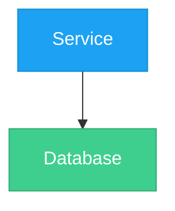

# Style Conventions — Mermaid図の標準規約

## 1. ノードID規約

| ルール | 例 |
|--------|-----|
| 2-4文字の大文字略称 | `DB`, `API`, `GHA`, `PW`, `MCP` |
| サービス名そのままも可 | `X`, `Vercel`, `Claude` |
| 連番（A, B, C...）はデータフロー図でのみ使用 | `A["Source"]`, `B["Process"]` |

## 2. 表示テキスト規約

- サービス名 + 技術スタックを `\n` で改行: `"Next.js 15\nTailwind CSS v4"`
- 補足情報は `()` で括る: `"X Profile Page\n(x.com)"`
- 引用符で囲む: `["テキスト"]`（角括弧 + 引用符）

## 3. ノード形状

| 形状 | 構文 | 用途 |
|------|------|------|
| 四角（標準） | `["テキスト"]` | サービス、アプリケーション |
| 円柱（DB） | `[("テキスト")]` | データベース、ストレージ |
| ひし形 | `{"テキスト"}` | 判断・分岐 |
| 角丸四角 | `("テキスト")` | 汎用プロセス |
| 六角形 | `{{"テキスト"}}` | イベント、トリガー |

## 4. レイアウト方向

| 目的 | 方向 | 指示 |
|------|------|------|
| 階層・デプロイ構成 | 上→下 | `graph TB` |
| システム概要 | 上→下 | `graph TB` or `graph TD` |
| データフロー・パイプライン | 左→右 | `flowchart LR` |
| プロセスフロー | 左→右 | `flowchart LR` |

## 5. エッジ（矢印）規約

| パターン | 構文 | 用途 |
|----------|------|------|
| 単方向 + ラベル | `-->\|"ラベル"\|` | 標準（全矢印にラベル推奨） |
| 双方向 | `<-->\|"ラベル"\|` | 双方向通信（stdio等） |
| 破線 | `-.->` | 非同期・オプショナル |

ラベルの書き方:
- 動詞 + 目的語: `"write data"`, `"read data"`, `"deploy"`
- プロトコル/技術: `"GraphQL\nResponse"`, `"MCP protocol"`, `"stdio"`
- 引用符で囲む: `|"ラベル"|`

## 6. Subgraph規約

### 命名
- ID: PascalCase — `ExternalServices`, `Dashboard`, `SupabaseCloud`
- 表示名: `subgraph ID["表示名"]` — `subgraph Vercel["Vercel (Cloud)"]`

### ネスト
- 最大2階層まで: `System > Dashboard > NextJS`
- 用途別グループ化: External / System / Local / Cloud

### スタイル適用
- subgraphには `style SubgraphID fill:...,stroke:...` でパステル背景を適用

## 7. カラーパレット

### 7.1 サービス別ノードカラー

ブランドカラーに基づく。ノードに `style` で直接適用する。

| サービス | fill | color | stroke | 用途 |
|----------|------|-------|--------|------|
| X (Twitter) | `#1DA1F2` | `#fff` | `#0d8ecf` | SNS関連 |
| Supabase | `#3ECF8E` | `#fff` | `#2ea872` | BaaS/DB |
| GitHub | `#24292e` | `#fff` | `#555` | リポジトリ/CI |
| Vercel | `#000` | `#fff` | `#333` | ホスティング |
| Next.js | `#000` | `#fff` | `#333` | Webフレームワーク |
| Claude | `#d4a574` | `#fff` | `#b8864a` | AI |
| 汎用/外部 | `#f0f0f0` | (default) | `#999` | その他サービス |
| AWS | `#FF9900` | `#fff` | `#cc7a00` | クラウド |
| GCP | `#4285F4` | `#fff` | `#3367d6` | クラウド |
| Azure | `#0078D4` | `#fff` | `#005a9e` | クラウド |

適用構文:
```
style NodeID fill:#1DA1F2,color:#fff,stroke:#0d8ecf
```

### 7.2 Subgraphティア別カラー（パステル背景）

subgraphの `fill` に使用。文字色は指定不要（デフォルト黒）。

| ティア | fill | stroke | 用途 |
|--------|------|--------|------|
| Frontend / UI | `#dbeafe` | `#2563eb` | ダッシュボード、Web画面 |
| Backend / API | `#dcfce7` | `#16a34a` | サーバー、API |
| Data / Storage | `#fce7f3` | `#db2777` | DB、ストレージ |
| Infrastructure | `#fef3c7` | `#d97706` | MCP、ミドルウェア |
| External | `#f0f0f0` | `#999` | 外部サービス |
| System全体 | `#e8f4fd` | `#1DA1F2` | プロジェクト境界 |

適用構文:
```
style Dashboard fill:#dbeafe,stroke:#2563eb
```

### 7.3 プロジェクト固有カラーの追加方法

上記パレットにないサービスを使う場合:
1. サービスの公式ブランドカラーを `fill` に使用
2. `stroke` はfillより20-30%暗い色を設定
3. 暗い背景色には `color:#fff` を追加

## 8. style文の配置



ルール:
- `style` 文はファイル末尾にまとめる（ノード定義と混在させない）
- subgraphのstyleもノードのstyleも同じブロックに配置

## 9. DOCXスタイルプリセットとの連動

project-report スキルと組み合わせる場合、以下のマッピングでmmdc設定を生成する:

| DOCXスタイル | mmdc theme | primaryColor | lineColor |
|-------------|-----------|-------------|-----------|
| シンプル | neutral | F0F0F0 | 666666 |
| ブランドカラー | base | ${primaryColor} | ${accentColor} |
| フォーマル | dark | 1B3A5C | 2E75B6 |
| モダン | default | 2E75B6 | 00B0F0 |
| スタイリッシュ | dark | 1A1A2E | E94560 |
| エグゼクティブ | neutral | 2C3E50 | C9A84C |
| テック | base | 0D1117 | 58A6FF |

詳細は `rendering-guide.md` を参照。
